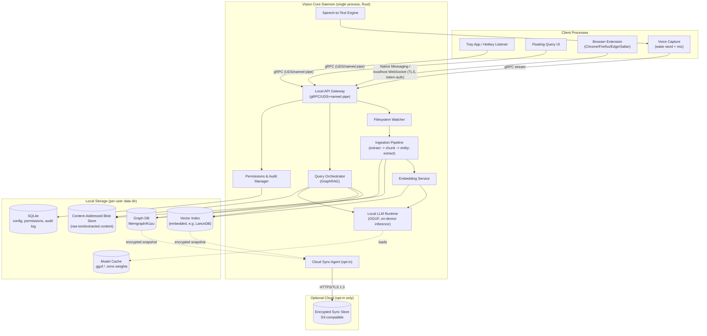

# ARCHITECTURE.md — Vision Desktop

This document describes the system architecture for Vision: what services run, how they communicate, and where data lives on disk. It is the technical companion to `PRD.md`.

## 1. Design Principles

- **Local-first.** Every service required for indexing and querying runs on-device. Nothing needs the network to function.
- **One long-lived core, one thin shell.** A single background daemon owns all state and heavy computation. The UI (tray app, floating query window, browser extension) is a disposable client that can restart without losing data.
- **Localhost-only IPC.** All inter-process communication is bound to loopback interfaces or OS-native local transports — never exposed to the network — so a compromised daemon can't become a remote attack surface.
- **Single writer to the graph.** Only the daemon writes to the graph/vector stores, to avoid multi-process file-lock contention on embedded databases.

## 2. High-Level System Diagram



## 3. Service Inventory

| Service | Process | Responsibility | Tech |
|---|---|---|---|
| **Tray App** | Separate client process | System tray icon, settings launcher, hotkey registration | Tauri (native shell, low idle overhead) |
| **Floating Query UI** | Spawned on hotkey/wake word | Text/voice query input, streamed answer rendering, source citations | Tauri webview |
| **Browser Extension** | Browser-managed process | Captures tab URLs, titles, page text, history events | WebExtension APIs (MV3), Native Messaging host |
| **Voice Capture** | Lightweight always-on client | Wake-word detection ("Hey Vision") on-device, streams audio to daemon only after trigger | Local wake-word model (e.g. Porcupine-style), small footprint |
| **Vision Core Daemon** | Single background service, autostart | Owns all state; hosts the services below as internal modules/threads | Rust |
| — Local API Gateway | in-daemon | Single entry point for all clients; auth, routing, backpressure | gRPC over Unix Domain Socket (macOS/Linux) / named pipe (Windows) |
| — Filesystem Watcher | in-daemon | Detects file create/modify/delete across permitted folders | `ReadDirectoryChangesW` (Win), `FSEvents` (macOS), `inotify` (Linux) |
| — Ingestion Pipeline | in-daemon (worker pool) | Text extraction, OCR, chunking, entity/relationship extraction | Rust + local NLP models |
| — Embedding Service | in-daemon | Generates vector embeddings for chunks and queries | Local embedding model via LLM runtime |
| — Local LLM Runtime | in-daemon | Hosts quantized LLM for embeddings, entity extraction, and answer synthesis | GGUF via `llama.cpp`/ONNX Runtime |
| — Speech-to-Text | in-daemon | Converts captured audio to text after wake word | Local STT model (e.g. Whisper.cpp) |
| — Query Orchestrator | in-daemon | Hybrid retrieval (vector + graph traversal), synthesis, source attribution | GraphRAG logic |
| — Permissions & Audit Manager | in-daemon | Enforces folder/app scopes, records what was indexed, handles deletion requests | Rust module + SQLite |
| — Cloud Sync Agent | in-daemon, disabled by default | Encrypts and pushes/pulls graph+vector snapshots for backup | HTTPS/TLS 1.3 client |

**Why one daemon instead of many OS services:** simplifies lifecycle management (single autostart entry, single upgrade path), avoids N-process lock contention on the embedded graph/vector stores, and keeps the machine's resource footprint predictable (one process to throttle under `5.2 Resource Throttling`).

## 4. Communication Architecture

### 4.1 Transport matrix

| From | To | Transport | Pattern |
|---|---|---|---|
| Tray App / Query UI | Daemon (API Gateway) | gRPC over UDS (macOS/Linux) or named pipe (Windows) | Request/response + server-streaming (for token-streamed answers) |
| Browser Extension | Daemon (API Gateway) | Native Messaging (stdio) for Chrome/Firefox/Edge; localhost WebSocket with per-install auth token for Safari (which lacks a native messaging equivalent) | Async push (page visited, tab closed) |
| Voice Capture | Daemon | gRPC client-streaming (audio chunks) after local wake-word trigger | Streaming |
| Watcher → Ingestion → Embedding → Graph/Vector write | All in-process | Internal async channels (Tokio mpsc) | Pipeline / producer-consumer, backpressured |
| Query Orchestrator → Graph DB | In-process (embedded) or Bolt protocol over localhost if run as local child process (Memgraph) | Request/response |
| Query Orchestrator → Vector Index | In-process embedded call | Request/response |
| Query Orchestrator → LLM Runtime | In-process embedded call | Streaming token generation |
| Sync Agent → Cloud | HTTPS/TLS 1.3, mutual auth via device key | Async batch push/pull |

**No component talks to the graph or vector store directly except the daemon.** Clients (tray, query UI, browser extension) never see storage — they only ever speak to the API Gateway, which enforces permissions before any read/write reaches storage. This is the one hard boundary in the system.

### 4.2 Local API Gateway contract (summary)

Exposed as gRPC services on the local transport, versioned, token-authenticated per-client (token issued at install time, rotated on update):

- `IngestEvent(source, path/url, content-ref)` — used by Watcher/extension to submit new activity
- `Query(text | audio-stream) -> stream<AnswerChunk>` — used by Query UI/Voice for NL queries, streams partial tokens + final source list
- `GetGraph(scope) -> GraphSlice` — used by the concept-map/timeline visualizer
- `Permissions.{Get,Set,Revoke}` — used by the settings UI
- `Audit.{List,Delete}` — used by settings UI for the audit log / "forget this" actions

### 4.3 Why not HTTP/REST over the network stack

Even loopback HTTP invites accidental exposure (misconfigured firewall, port conflicts, other localhost processes probing well-known ports). UDS/named pipes are filesystem-permissioned (only the invoking OS user can connect), which better matches the "no data exfiltration" requirement in the PRD's privacy section. The one exception is Safari's WebSocket bridge, which is mitigated with a per-install random token and `127.0.0.1`-only binding.

## 5. Data Storage

### 5.1 Storage locations

| OS | Base data directory |
|---|---|
| Windows | `%LOCALAPPDATA%\Vision\` |
| macOS | `~/Library/Application Support/Vision/` |
| Linux | `~/.local/share/vision/` |

```
Vision/
├── graph/            # embedded graph DB files (nodes, edges, indexes)
├── vectors/          # embedded vector index (chunk embeddings)
├── blobs/            # content-addressed store: extracted text/OCR output, keyed by hash
├── models/           # cached LLM/embedding/STT model weights (.gguf, .onnx)
├── config.sqlite      # settings, folder/app permissions, sync state
├── audit.sqlite        # append-only log of indexed items (source, timestamp, path) for the Audit Log UI
└── logs/              # daemon logs (rotated, no content bodies — metadata only)
```

### 5.2 What lives where, and why

| Store | Contents | Format | Notes |
|---|---|---|---|
| **Graph DB** | Nodes (documents, projects, people, concepts) with typed metadata; edges (`cites`, `relates-to`, `authored-by`, `used-in`) | Memgraph (or Kùzu for a lighter embedded footprint in MVP) | Source of truth for structured relationships; queried via graph traversal for `5.3`/`5.6` features |
| **Vector Index** | Chunk-level embeddings + pointer to blob + graph node ID | LanceDB or equivalent embedded ANN index | Powers semantic/fuzzy matching in hybrid search (`5.5`) |
| **Blob Store** | Extracted plain text, OCR output — never the original files themselves | Content-addressed flat files (SHA-256 keyed) | Vision indexes derived text, not copies of user files, to minimize duplication; original files stay wherever the user put them and are re-read/re-extracted on change |
| **config.sqlite** | Folder/app permission grants, feature flags, sync preferences, install token | SQLite | Small, transactional, needs ACID guarantees for permission toggles |
| **audit.sqlite** | One row per indexed item: source type, path/URL, timestamp, graph node ID | SQLite, append-only + soft-delete | Backs the "view what Vision has indexed / delete items or time ranges" requirement (`5.7`) |
| **Model Cache** | Quantized local LLM, embedding model, STT/wake-word model weights | GGUF/ONNX files | Downloaded once at install/first-run, versioned, no user content |

### 5.3 Encryption & deletion

- **At rest:** the entire base data directory is encrypted with AES-256 via an OS-backed key (Windows DPAPI / macOS Keychain-wrapped key / Linux Secret Service), so storage is opaque without the logged-in user's session.
- **Deletion:** deleting an item via the Audit Log issues a coordinated delete across all four stores (graph node + edges, vector rows, blob file, audit row) inside a single daemon-managed transaction boundary — no store is allowed to retain an orphaned reference.
- **Cloud sync (opt-in only):** the Sync Agent uploads encrypted snapshots of `graph/` and `vectors/` (never `blobs/` raw text, to minimize what leaves the device) over TLS 1.3 to an S3-compatible backend; encryption keys never leave the device.

## 6. End-to-End Data Flows

### 6.1 Flow A — New content gets indexed

```
File saved / browser tab visited
   -> Watcher or Browser Extension emits IngestEvent to API Gateway
   -> Ingestion Pipeline: extract text (+OCR if needed) -> write to Blob Store
   -> Ingestion Pipeline: entity/relationship extraction (LLM Runtime) -> upsert nodes/edges in Graph DB
   -> Embedding Service: chunk + embed extracted text -> write vectors to Vector Index (with blob + graph node references)
   -> Audit Manager: append record to audit.sqlite
Target latency: <5s end-to-end (PRD 7.3)
```

### 6.2 Flow B — User asks a question

```
Hotkey/wake word -> Query UI/Voice opens, sends Query() to API Gateway
   -> STT (if voice) transcribes -> text query
   -> Query Orchestrator: embed query -> ANN search in Vector Index -> candidate chunks
   -> Query Orchestrator: graph traversal from candidate nodes -> pulls connected context (related docs, projects, people)
   -> Query Orchestrator: assembles context -> LLM Runtime streams synthesized answer
   -> API Gateway streams AnswerChunks to Query UI, each citing blob/graph source + timestamp + path
Target latency: <2s for 90% of queries (PRD 7.3)
```

## 7. Process & Deployment Topology

- **Autostart:** daemon registers as a Windows Service / macOS `launchd` agent / Linux `systemd --user` unit, started at login, restarted on crash with backoff.
- **Resource governance:** daemon self-throttles ingestion workers based on OS CPU/memory pressure signals (PRD 5.2); query handling is always prioritized over background indexing.
- **Single instance:** API Gateway acquires an exclusive lock file on startup; a second daemon instance refuses to start and instead proxies to the running one (prevents duplicate writers to the embedded graph/vector stores, per the `Single writer` principle in §1).
- **Updates:** daemon and clients are versioned together; the daemon exposes a schema/version handshake on connect so a stale Tray App/extension can prompt for update rather than sending incompatible requests.

## 8. Security Boundaries

- Clients are **untrusted relative to the daemon** — even though they're first-party, all permission checks happen daemon-side (a compromised Query UI can't read out-of-scope folders by asking nicely).
- Browser extension traffic is the largest external attack surface (extension processes are more exposed than native apps) — hence the token-per-install auth and localhost-only binding called out in §4.3.
- No inbound network listeners besides the loopback-bound Safari bridge; the Sync Agent is outbound-only (no listening socket for cloud sync).
- Model Cache and Blob Store are never included in the same encrypted volume export as `config.sqlite`'s install token, to avoid model/re-usable binaries and secrets sharing a backup artifact.

## 9. Open Questions

- **Graph DB choice for MVP:** Memgraph (server-like local process, richer Cypher support) vs. Kùzu (true embedded library, simpler deployment, less mature ecosystem). Recommend starting with Kùzu for Phase 1 MVP simplicity, revisiting Memgraph if traversal performance at 100K+ nodes (PRD 7.3) demands it.
- **Cross-device sync conflict resolution:** not yet specified — needed once the premium tier's cloud sync (PRD 5.7, Phase 2) supports multiple devices per user.
- **Browser extension content capture depth:** full page text vs. title/URL-only by default, given privacy sensitivity — needs a product decision, not just an engineering one.
